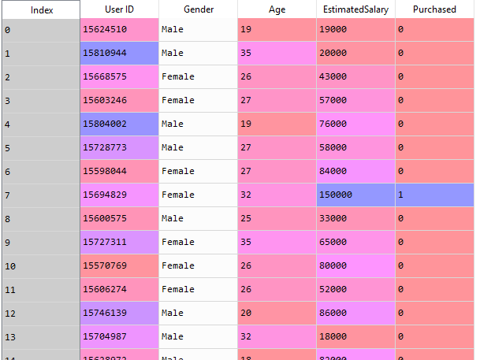
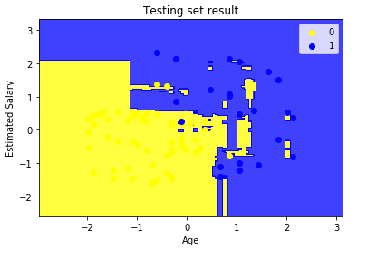
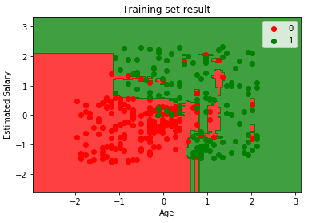

# Random-Forest-Model
# Business problem statement
In this case, the company collected the 400 points from the customer historical purchase record. The marketing team intuitively believe the customer's age and estimated salary contribute to the final deal. The company want to find a new model using the customer's age and estimated salary to predict the customer buying result.
# Input raw dataset

# Results

# Conclusion
The model trained by 20 decision trees and ensembled to build a high accurate model to predict the customer purchase by two inputs, age and estimated salary. The model will help the company to better target the potential buyer group and in return has a better ROI per labour force.  
